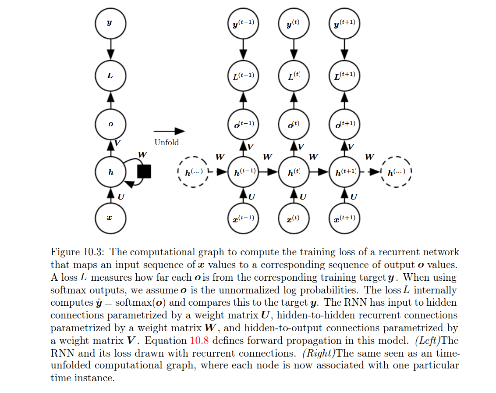
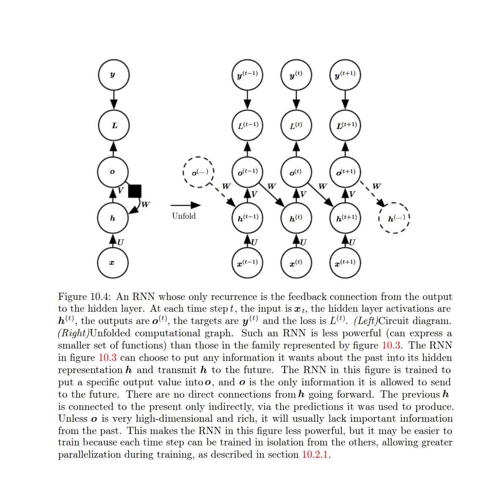
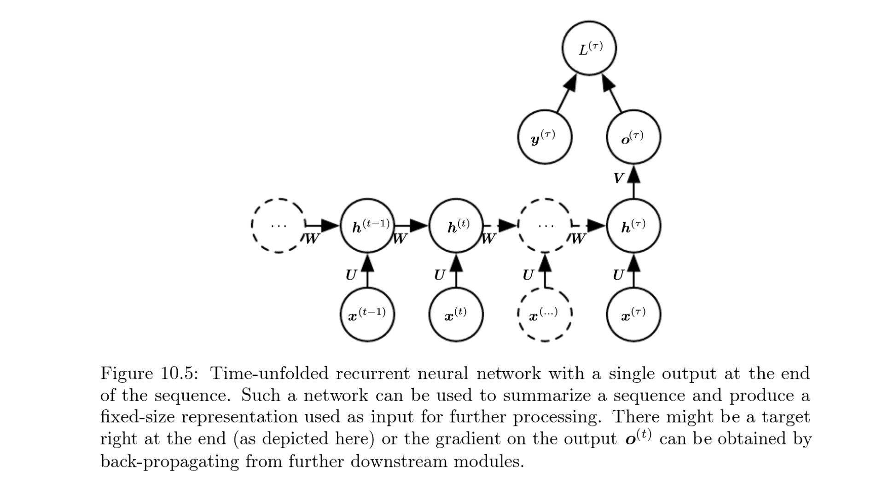

### Conceptual

1) Parameter sharing accross time makes it possible to  extend and apply the modewl to different lengths and generalise accross them.

2) Conventional wisdom suggests having seperate parameters for each value of the time index means the model will not generalize to seqlens not seen during training nor share statistical strength across different sequence lengths and accross different positions in time.

3) The convolution operation allows a network to share parameters accross time but is shallow

4) Transformers use positional embeddings but these do not seem to generalise well to lengths seen above training. Recurrant transformers do not fix this issue as they share parameters accross depth not time.

### Hidden State

Learn to use $h_t$ as a kind of lossy summary of the task  relevant aspects of the past sequence of inputs up to $t$. 

Necesarily lossy since it maps a sequence of arbitrary length ($x_t, x_{t-1}$...,x_1) into fixed length vector $h_t$

$h_t = g_t(x_t, x_{t-1}...,x_1)$

$f(h_{t-1},x_t;\theta)$

$g_t$ takes the whole past sequences of inputs and produces current state but the unfolded recurrent structure allows us to factorize it into repeated application of a function $f$

Allows us to learn a single model $f$ that operates on all time steps and all sequence lengths instead of learning different model for each time step. This allows generalization to sequence lengths that did not appear in training set.

Makes the model more sample efficient.

### Architecture

1) Produce an output ar each time step, have recurrent connections between hidden units. Vanilla RNN.

2) Produce output at each time step, have recurrent connections only from output at one time step to the hidden units at the next time step. Less powerful then 1. 1 can put any information about the past into hidden state and pass it to the future while 2 only passes specific output value  into the future. 

Universal Transformer repeatedly applies the same Transformer block, but each repeat mainly passes forward the current hidden representation. If you carried representations forward instead of overwriting them at each step, (CoTFormer) it would be able to attend representations at each time step in the past. This gives them an iterative-computation inductive bias, but it is not the same inductive bias as an RNN scanning a sequence token by token. However this allows greater parallelization with teacher forcing.

#### Teacher Forcing with output recurrence
2 strictly less powerful then 1 due to lack of hidden to hidden recurrent connections. As outputs are explicitly trained to match training set targets they are unlikely to contain necessary information about past state of the input unless user knows how to describe full state of the system and provides it as a part of the training targets.

By eliminating hidden to hidden recurrance we can feed the correct answer output to the next time steps hidden state allowing us to parallelise training. Thus time steps are decoupled and can be computed in parallel. Gradients computed in isolation.

Teacher forcing can still be applied to models with hidden to hidden connections, especially during early training to stabilise things. The condition is that they need to have connections from the output of one time step to the values computed at the next time step. As soon as hidden units become a function of earlier timesteps the BPTT algorithm becomes necessary.

3) Recurrent connections between hidden units that read an entire sequence and produce a single output.

#### The poing about graphical models:

An RNN is a way to model the full joint distribution of a sequence by repeatedly updating a hidden state, using the same parameters at every time step, rather than learning a separate giant conditional distribution for every possible history. The main bottleneck becomes the hidden state.

Talks about seq2seq encdec etc. says attention was introduced so elements of seq C could attend to elements of output seq. In addition tto that to counteract the hidden state bottleneck they proposed to make C a variable lenght sequence

### 
## References

These notes are based on *Deep Learning* by Ian Goodfellow, Yoshua Bengio and Aaron Courville, MIT Press, 2016. Some explanations and redrawn figures are adapted from the book unless otherwise stated.

[1] Ian Goodfellow, Yoshua Bengio and Aaron Courville, *Deep Learning*, MIT Press, 2016. Available online: http://www.deeplearningbook.org